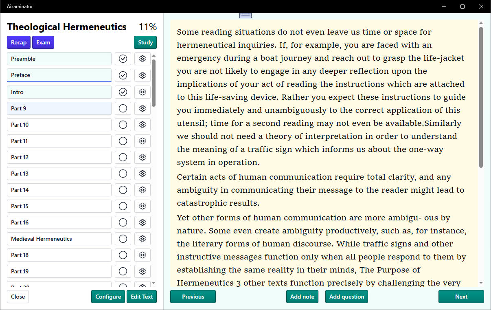

# Aixaminator

An experimental AI powered study tool from early 2025.

Import a document (PDF, EPUB, plain text or a Wikipedia article), read it part by part, highlight passages,
take notes and write questions as you go, then study them or let an AI generate a recap quiz.


*(Screenshot of the 1.x interface; 2.0 uses Avalonia's Fluent look.)*

## Requirements

* [.NET 10 SDK](https://dotnet.microsoft.com/download)
* Linux (X11) or macOS. Windows works too.

Aixaminator 2.0 is built with [Avalonia](https://avaloniaui.net) and the MVVM pattern
([CommunityToolkit.Mvvm](https://learn.microsoft.com/dotnet/communitytoolkit/mvvm/)); it replaces the
Windows-only .NET MAUI / Blazor Hybrid version.

## Running

```sh
dotnet run --project Aixaminator
```

To create a self-contained build, publish for the target platform, e.g.:

```sh
dotnet publish Aixaminator -c Release -r osx-arm64   # or osx-x64, linux-x64, win-x64
```

AI features (Recap quizzes and "Clean Text" in edit mode) need an API key for OpenAI, Google (Gemini) or
OpenRouter, added under **Settings**.

## Where data is stored

Everything lives in one directory:

| Platform | Location |
| -------- | -------- |
| Linux    | `~/.local/share/Aixaminator` |
| macOS    | `~/Library/Application Support/Aixaminator` |
| Windows  | `%LOCALAPPDATA%\Aixaminator` |

Debug builds use `AixaminatorDebug` instead, and the `AIXAMINATOR_DATA_DIR` environment variable overrides
the location entirely. The directory contains `aixaminator.db` (SQLite: documents, parts and notes),
`settings.json` and `documents/<id>/<part>.txt` (the text of each part).

**2.0 is a breaking change:** documents and settings from 1.x are not migrated.

## Tests

```sh
dotnet test
```

The suite contains unit tests for the domain logic, services and view models, plus headless UI tests
(`Aixaminator.Tests/Headless`) that run the real application — views, styles, database — on Avalonia's
headless platform and drive it with simulated mouse and keyboard input. No display or network is needed.

The [Dockerfile](Dockerfile) builds the solution and runs the tests on Linux.

## Project layout

| Project | Contents |
| ------- | -------- |
| `Aixaminator` | The desktop application |
| `Aixaminator.Tests` | Unit and headless UI tests (xUnit v3, Avalonia.Headless.XUnit) |
| `Importers` | Text extraction from PDF, EPUB and Wikipedia |
| `SemanticSlicer` | Text chunking library (reserved for automatic document splitting) |

Inside `Aixaminator`:

* `Data/` – EF Core entities, `AppDbContext` and migrations.
* `Models/` – settings, AI configuration, quizzes and colour palettes.
* `Features/` – UI-independent logic: paragraph parsing, highlight resolution, the reader's text model
  (`ReaderContent`, which maps text selections to highlight locations), text clean-up and summarising.
* `Services/` – persistence (`DocumentRepository`), settings, document import, AI providers, navigation,
  dialogs and dependency injection setup (`ServiceCollectionExtensions`).
* `ViewModels/` – one view model per page, tab, document mode and dialog.
* `Views/`, `Controls/`, `Behaviors/`, `Converters/`, `Styles/` – Avalonia XAML and supporting UI code.
  Views are matched to view models through the data templates in `App.axaml`.

### Database migrations

The schema is managed with EF Core migrations, applied automatically at start-up. After changing the
model in `Data/`, add a migration with the [EF Core tools](https://learn.microsoft.com/ef/core/cli/dotnet):

```sh
dotnet ef migrations add <Name> --project Aixaminator --output-dir Data/Migrations
```
